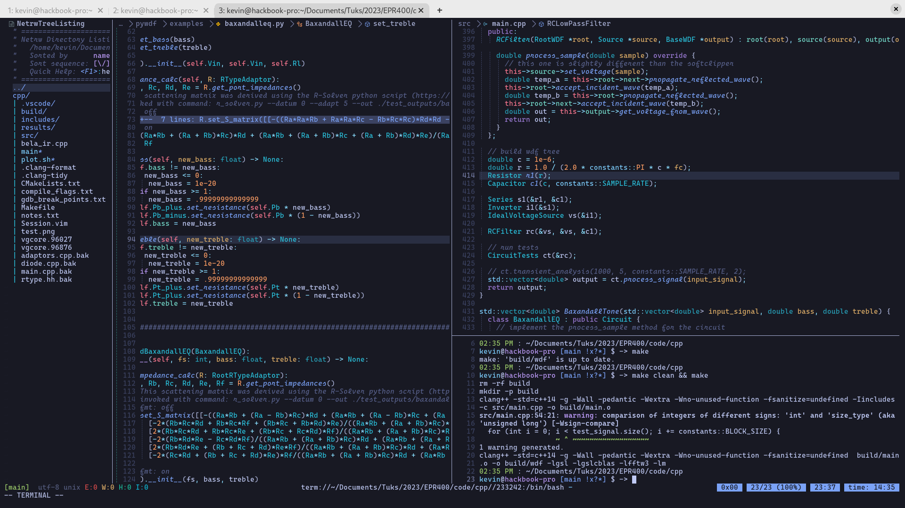

# linux-configs

My configs. I use `fish`, and `nvim`. My `.bashrc` is still there because it's required by my OS and I have a minimal
vim config that I use when sshing. There are also configs for `sway`, and some other applications; which I don't
currently use.

## nvim

My main nvim config. It doesn't use Mason, it still uses Lazy for package management. LSPs are installed via system
package manager. You just need them on `$PATH`. I have left comments next to the lsp setup functions in `lsp.lua` to
show how I installed them. I try to not use plugins for simple things and have custom functions and autocmds for things.
I use a lot of treesitter features. Telescope is a must. I tried to live without it, but it makes life quite a bit
easier for fuzzy finding.



## nvim_minimal

The `nvim_minimal` config does not use a package manager and tries to use few plugins. Plugins are in pack.zip, just
extract them, or use `./dl_plugins.sh` to download them. LSPs should be installed and available in your `$PATH` (this
config doesn't use mason) the file tree should look like this

```text
./
|-- after/
|   `-- plugin/
|       `-- fuzz.lua
|-- ftplugin/
|   |-- cpp.lua
|   |-- lua.lua
|   |-- markdown.lua
|   |-- netrw.lua
|   |-- python.lua
|   `-- rust.lua
|-- lua/
|   `-- k/
|       |-- cmp.lua
|       |-- configs.lua
|       |-- keymaps.lua
|       |-- lsp.lua
|       |-- statusline.lua
|       `-- treesitter.lua
|-- pack/
|   |-- Comment.nvim/
|   |   `-- start/
|   |-- LuaSnip/
|   |   `-- start/
|   |-- cmp-buffer/
|   |   `-- start/
|   |-- cmp-cmdline/
|   |   `-- start/
|   |-- cmp-nvim-lsp/
|   |   `-- start/
|   |-- cmp-path/
|   |   `-- start/
|   |-- cmp_luasnip/
|   |   `-- start/
|   |-- gitsigns.nvim/
|   |   `-- start/
|   |-- nightfox.nvim/
|   |   `-- start/
|   |-- nvim-cmp/
|   |   `-- start/
|   |-- nvim-lspconfig/
|   |   `-- start/
|   |-- nvim-treesitter/
|   |   `-- start/
|   |-- nvim-treesitter-context/
|   |   `-- start/
|   |-- nvim-treesitter-refactor/
|   |   `-- start/
|   `-- nvim-treesitter-textobjects/
|       `-- start/
`-- init.lua
```
